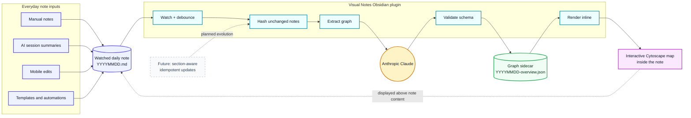
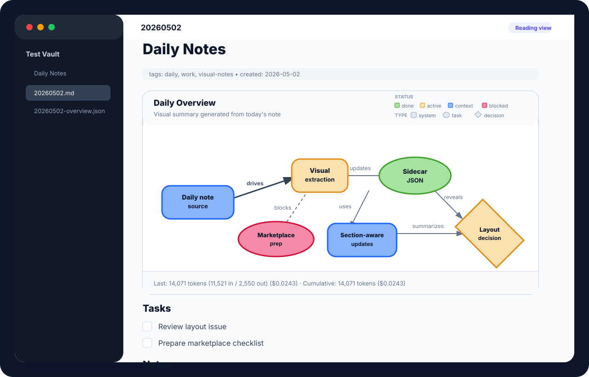

# Visual Notes

> Turn an Obsidian daily note into a living concept map.

Visual Notes watches the markdown files you already use for daily notes,
asks Claude to extract the main concepts and relationships, and renders an
interactive Cytoscape.js graph directly inside Obsidian.

The markdown note stays the source of truth. Manual notes, AI session
summaries, mobile edits, Templater output, and synced changes all flow
through the same pipeline: if it lands in a watched note, it can appear in
the visual.

## Why it is useful

- **A visual daily recap:** see the day's work, decisions, blockers, and
  cross-domain connections at a glance.
- **Works with any note source:** Claude Code, OpenCode, Copilot, manual
  typing, and mobile edits all become ordinary markdown input.
- **No separate graph editor:** edit the note; Visual Notes regenerates the
  graph sidecar.
- **Useful for memory and navigation:** nodes summarize important concepts;
  labeled edges explain why they matter.

## What it does



## What it looks like in Obsidian

Visual Notes renders as a card at the top of the note in both reading and edit
views. The graph is interactive; the note remains normal markdown underneath.



Feature overview:

- Watches one or more configured daily-note folders.
- Debounces saves and skips unchanged content using a markdown hash.
- Sends structured Daily Context sources to the Anthropic Messages API when
  the `daily-context` plugin is available, otherwise falls back to full note
  markdown.
- Validates the returned graph against the shared sidecar schema.
- Writes `{date}-overview.json` next to the note.
- Renders the sidecar inline in reading and source views.
- Supports pin/unpin/delete/regenerate commands for manual control.
- Shows extraction count and status in the Obsidian status bar.
- Tracks token usage and estimated cost metadata in the sidecar when the API
  response includes usage.

## Project pieces

This repository contains two plugins and one shared schema:

| Piece | Purpose | Status |
|---|---|---|
| [`plugins/obsidian-plugin`](plugins/obsidian-plugin/README.md) | Primary Obsidian plugin. Watches notes, calls Claude, writes sidecars, and renders Cytoscape inline. | MVP implementation in progress |
| [`plugins/claude-code-plugin`](plugins/claude-code-plugin/README.md) | Optional companion for agent-curated sidecars after AI session summaries. | Scaffolded; migration pending |
| [`shared/schema.json`](shared/schema.json) | JSON Schema contract for sidecar graph files. | Defined |
| [`docs/design.md`](docs/design.md) | Living design document for open/future work. | Maintained as decisions evolve |

The Obsidian plugin is the main product. The Claude Code plugin is optional:
it can pre-populate or pin curated sidecars, but Visual Notes does not depend
on Claude Code.

## Architecture at a glance

```text
Daily note folder
├── 20260501.md              # source markdown
└── 20260501-overview.json   # generated graph sidecar

Obsidian plugin
├── settings tab             # API key, watched folders, debounce, model, Daily Context
├── file watcher             # only watched markdown files
├── extractor                # requestUrl -> Anthropic Messages API
├── schema validation        # Zod + shared/schema.json
└── renderer                 # Cytoscape in MarkdownRenderChild
```

Important invariants:

1. The `.md` note is read-only input for the plugin.
2. The sidecar JSON is the source of truth for rendered graph data.
3. `_pinned: true` on a sidecar suppresses automatic re-extraction unless the
   user runs force regenerate.
4. The renderer tolerates unsupported future sidecar kinds by showing a
   placeholder instead of crashing.
5. Daily Context integration is optional; direct markdown extraction remains the
   fallback when the provider is unavailable or not applicable to a note.

## Install and setup

### Obsidian plugin

Until a release is published, use the development workflow:

```bash
pnpm install
pnpm --filter @visual-notes/obsidian-plugin build
```

Then copy or symlink `plugins/obsidian-plugin` into your vault's
`.obsidian/plugins/visual-notes` directory and enable **Visual Notes** in
Obsidian's Community plugins settings.

After enabling:

1. Open **Settings → Visual Notes**.
2. Paste an Anthropic API key.
3. Add at least one watched folder, such as `Daily Notes` or `Captains Log`.
4. Choose a debounce and model, or keep the defaults.
5. Save or manually extract a note with
   **Visual Notes: Extract from current note**.

See the plugin README for detailed Obsidian-specific instructions:
[`plugins/obsidian-plugin/README.md`](plugins/obsidian-plugin/README.md).

### Claude Code companion plugin

The Claude Code companion is scaffolded but not yet migrated from the
original private workflow. Its intended install path is:

```text
/plugin install bobthearsonist/visual-notes/plugins/claude-code-plugin
```

See [`plugins/claude-code-plugin/README.md`](plugins/claude-code-plugin/README.md).

## Commands

The Obsidian command palette exposes:

- **Visual Notes: Extract from current note** — manually extract the active
  markdown file unless its sidecar is pinned.
- **Visual Notes: Extract from current note using Daily Context** — manually
  extract through the Daily Context provider and do not fall back to raw
  markdown if that provider is unavailable.
- **Visual Notes: Regenerate (force)** — bypasses cached hash and pin state,
  with a per-file cooldown.
- **Visual Notes: Pin this overview** — preserves the current sidecar from
  automatic replacement.
- **Visual Notes: Unpin this overview** — resumes automatic extraction.
- **Visual Notes: Delete sidecar** — removes the generated graph sidecar.

## Privacy and cost

Visual Notes sends either the configured Daily Context sources or the active
note markdown to the Anthropic API when extraction runs. Do not add folders or
Daily Context sources containing notes you do not want sent to a third-party API.

Bring your own API key; this project does not proxy requests or aggregate
usage. At the default Haiku model, a typical extraction is designed to cost
only a few fractions of a cent, but actual spend depends on note length,
model, save frequency, and retries. The plugin shows today's extraction count
and stores usage metadata when available.

## Development

Requirements:

- Node.js 20+
- pnpm

Common commands:

```bash
pnpm install
pnpm build
pnpm typecheck
pnpm lint
```

Repository layout:

```text
visual-notes/
├── README.md                         # this file
├── LICENSE                           # MIT
├── manifest.json                     # marketplace metadata mirror
├── versions.json                     # marketplace compatibility mirror
├── docs/
│   ├── design.md
│   └── marketplace-readiness.md      # release/submission checklist
├── scripts/
│   └── package-obsidian-plugin.mjs   # builds release-ready Obsidian assets
├── shared/
│   ├── package.json
│   └── schema.json
└── plugins/
    ├── obsidian-plugin/
    │   ├── README.md
    │   ├── manifest.json
    │   ├── prompts/extract-graph.md
    │   └── src/
    └── claude-code-plugin/
        ├── README.md
        ├── .claude-plugin/plugin.json
        ├── hooks/
        └── skills/visual-notes/
```

## Deeper docs and planning

- [Obsidian plugin README](plugins/obsidian-plugin/README.md)
- [Claude Code plugin README](plugins/claude-code-plugin/README.md)
- [Living design document](docs/design.md)
- [Marketplace readiness checklist](docs/marketplace-readiness.md)
- [Project issues](https://github.com/bobthearsonist/visual-notes/issues)

Marketplace readiness is tracked in
[`docs/marketplace-readiness.md`](docs/marketplace-readiness.md). To produce
release-ready Obsidian assets, run `pnpm package:obsidian` from the repo root.
The root `manifest.json`/`versions.json` files are marketplace-facing mirrors of
the Obsidian plugin metadata under `plugins/obsidian-plugin`.

## License

MIT — see [LICENSE](LICENSE).
