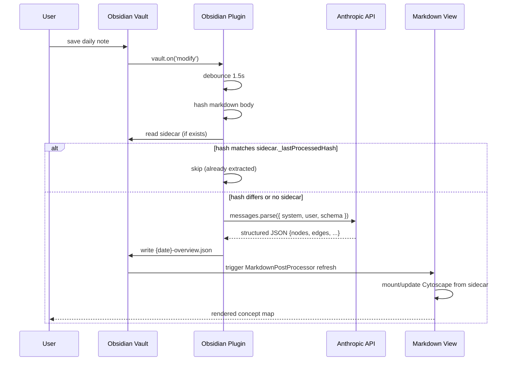

# Visual Notes

> A living concept map of your day, generated from your Obsidian daily notes.

Visual Notes watches your daily-note markdown, extracts the day's concepts and
relationships via an LLM, and renders an interactive graph at the top of the
note. The visual reflects **everything in the file** — AI session summaries,
manual notes, mobile edits, content from any source — not just what one
specific tool put there.

The repository ships **two plugins** that share a JSON sidecar schema:

1. **Obsidian plugin** (TypeScript) — primary artifact. Watches files, calls
   the Claude API, renders Cytoscape inline. Cross-platform (desktop + mobile),
   independent of any AI client.
2. **Claude Code plugin** (markdown + bash) — secondary. A hook + skill that
   nudges AI agents to write good session summaries; lets the agent
   pre-populate the sidecar before the LLM extraction overwrites it.

Either plugin works alone. They compose if you have both.

---

## Architecture overview

```
                                ┌──────────────────────────────────┐
                                │         Daily Note (.md)         │
                                │  YYYYMMDD.md in watched folder   │
                                └─────┬───────────────────────┬────┘
                                      │ writes                │ embeds iframe
                                      │ via various paths     │
                                      ▼                       │
                ┌──────────────────────────────────────┐      │
   manual ─────►│                                      │      │
   typing       │                                      │      │
                │             Markdown body            │      │
   AI agent ───►│      (the universal interface)       │      │
   (any client) │                                      │      │
                │                                      │      │
   sync from ──►└──────────────────────────────────────┘      │
   another                       │                            │
   device                         │ vault.on('modify')        │
                                  ▼                           │
                       ┌──────────────────────┐               │
                       │  OBSIDIAN PLUGIN     │               │
                       │  ─────────────────   │               │
                       │  watcher → debounce  │               │
                       │  → hash-check        │               │
                       │  → Claude API        │               │
                       │  → write sidecar     │               │
                       │  → trigger render    │               │
                       └─────────┬────────────┘               │
                                 │                            │
                                 ▼                            │
                       ┌──────────────────────┐               │
                       │  Sidecar (JSON)      │               │
                       │  {date}-overview.json│◄──────────────┤
                       │                      │               │
                       │  shared schema       │               │
                       └─────────┬────────────┘               │
                                 │                            │
                                 │ MarkdownPostProcessor      │
                                 │ reads + mounts Cytoscape   │
                                 ▼                            │
                       ┌──────────────────────┐               │
                       │  Cytoscape canvas    │───────────────┘
                       │  (rendered inline)   │
                       └──────────────────────┘
```

### Data flow (Obsidian plugin path)



### Component boundaries

```
┌─────────────────────────────────────────────────────────────────┐
│                       visual-notes/                              │
│                                                                  │
│  ┌─────────────────────────────────────────────────────────┐    │
│  │  shared/                                                 │    │
│  │    schema.json    (JSON Schema — sidecar contract)       │    │
│  │  Consumed by both plugins                                │    │
│  └─────────────────────────────────────────────────────────┘    │
│              ▲                              ▲                    │
│              │                              │                    │
│  ┌───────────┴──────────────┐  ┌────────────┴───────────────┐   │
│  │ plugins/                 │  │ plugins/                   │   │
│  │   claude-code-plugin/    │  │   obsidian-plugin/         │   │
│  │                          │  │                            │   │
│  │ - hooks/                 │  │ - src/main.ts              │   │
│  │   - hooks.json           │  │ - src/extractor.ts         │   │
│  │   - run-hook.sh          │  │ - src/renderer.ts          │   │
│  │   - post-obsidian-       │  │ - src/settings.ts          │   │
│  │     append.md            │  │ - src/theme.ts             │   │
│  │ - skills/visual-notes/   │  │ - src/storage.ts           │   │
│  │   - SKILL.md             │  │ - prompts/                 │   │
│  │                          │  │   - extract-graph.md       │   │
│  │ TypeScript: none         │  │ - manifest.json            │   │
│  │ Distribution: marketplace│  │ - package.json             │   │
│  └──────────────────────────┘  │ Distribution: BRAT or      │   │
│                                │   community plugin store   │   │
│                                └────────────────────────────┘   │
└─────────────────────────────────────────────────────────────────┘
```

---

## Repository layout

```
visual-notes/
├── README.md              # this file
├── LICENSE                # MIT
├── docs/
│   └── design.md          # full design document → start here
├── shared/
│   └── schema.json        # sidecar JSON schema (the contract)
└── plugins/
    ├── claude-code-plugin/
    │   ├── README.md
    │   ├── .claude-plugin/plugin.json
    │   ├── hooks/
    │   └── skills/visual-notes/
    └── obsidian-plugin/
        ├── README.md
        ├── manifest.json
        ├── package.json
        ├── src/
        ├── prompts/
        └── templates/
```

---

## Install

### For Obsidian users (recommended)

The Obsidian plugin is the primary way to use Visual Notes — it works
regardless of what AI tools you use to write your notes.

**Beta channel (BRAT):**
1. Install [BRAT](https://github.com/TfTHacker/obsidian42-brat) in Obsidian.
2. In BRAT settings, add this repository:
   `https://github.com/bobthearsonist/visual-notes`
3. BRAT will install the Obsidian plugin.
4. In Visual Notes settings: paste your Anthropic API key, set the watched
   folder, save.
5. Edit a daily note → the visual appears at the top.

**Community plugin store** (after first stable release): search for "Visual
Notes" in Obsidian's settings → Community plugins.

See [`plugins/obsidian-plugin/README.md`](plugins/obsidian-plugin/README.md) for details.

### For Claude Code users

The Claude Code plugin adds a hook that lets AI agents pre-populate the
sidecar before the Obsidian plugin's auto-extraction runs. Useful if you
want agent-curated graph nodes for specific sessions.

```
/plugin install bobthearsonist/visual-notes/plugins/claude-code-plugin
```

See [`plugins/claude-code-plugin/README.md`](plugins/claude-code-plugin/README.md) for details.

---

## How extraction works (visually)

```
Daily note markdown                    LLM extraction                 Rendered graph
──────────────────                     ──────────────                 ───────────────
                                                                  ┌─ ┌──────────┐
 # Today                                                           │  │ "matcher │
                                                                   │  │  bug"    │ ──┐
 ## AI Session - hook fix                                          │  └──────────┘   │
 - [x] diagnosed matcher           ┌──────────────────┐            │       │ "fixed │
   field misuse                     │  Claude Haiku    │            │       │ by"    │
 - [x] fixed matcher / if split  ──►│  extraction      │ ──► JSON ──┤       ▼        │
                                    │  prompt + zod    │             │  ┌──────────┐ │
 ## Brian / CDP                     │  schema          │             │  │ "matcher/│ │
 Discussion about CDP updates,      └──────────────────┘             │  │  if split│ │
 next steps for integration                                          │  └──────────┘ │
                                                                     │       │       │
 ## Notes                                                            │       ▼       │
 - filed feedback re: hook                                           │  ┌──────────┐ │
   linter idea                                                       │  │"PostTool │ │
                                                                     └─►│ Use hook"│ │
                                                                        └──────────┘ │
                                                                              ▲      │
                                                                              └──────┘
                                                                       (interactive,
                                                                        zoomable,
                                                                        themed)
```

Status colors (green/yellow/blue/red), shapes (rectangle/ellipse/diamond),
and edge weights (thick/thin/dashed) are all set by the LLM following the
extraction prompt's design heuristics. See [`docs/design.md`](docs/design.md) §6 for the
full prompt and §7 for the visual style spec.

---

## Status

| Component | Status |
|---|---|
| Design doc | ✅ Complete (this commit) |
| Repo scaffold | ✅ Complete (this commit) |
| Obsidian plugin | 🚧 Phase 1 — scaffold only |
| Claude Code plugin | 🚧 Migration pending (existing implementation lives in private dotfiles repo) |
| Shared schema | ✅ Defined (`shared/schema.json`) |
| Distribution | ⏳ Awaiting first release |

---

## Contributing

This repo is in design phase. The full design lives in
[`docs/design.md`](docs/design.md) — read it before opening issues or PRs.

- Architecture decisions: see `docs/design.md` §10 (Open Questions)
- Patterns to follow: see `docs/design.md` §4-7
- Implementation phases: see `docs/design.md` §9

Major design changes should be proposed via PR to `docs/design.md` and any
new ADRs in `docs/decisions/`.

---

## License

MIT — see [LICENSE](LICENSE).
