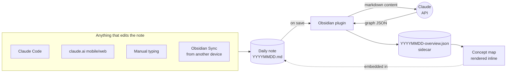
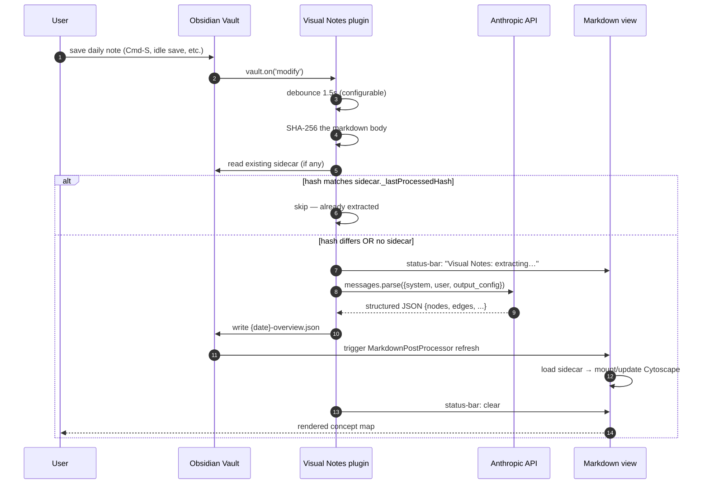

# Visual Notes

> A living concept map of your day, generated from your Obsidian daily notes.

You write in your daily note. Visual Notes reads it, extracts the day's
concepts and how they connect, and renders an interactive graph at the
top of the note — refreshed automatically as you write.

It captures **everything in the file** — AI session summaries, manually
typed notes, mobile edits, content from any source. The markdown is the
universal interface; whatever lands there ends up in the visual.

```
                       ┌─────────────────────────────────┐
                       │        20260501-overview.html   │
                       │                                 │
                       │   ┌─[hook fix]──┐               │
                       │   │             ▼               │
                       │   │      ┌─────────────┐        │
                       │   │      │ matcher/if  │        │
                       │   │      │   split     │        │
                       │   │      └──────┬──────┘        │
                       │   │             │ powers        │
                       │   │             ▼               │
                       │   │      ┌─────────────┐        │
                       │   │      │ PostToolUse │        │
                       │   │      │    hook     │ ◄──┐   │
                       │   │      └─────────────┘    │   │
                       │   │                         │   │
                       │   │  ┌──[Brian's CDP]──┐    │   │
                       │   │  ▼                 │    │   │
                       │   │  ◇ context     ─ ─ ┘    │   │
                       │   │                         │   │
                       │   └──── (cross-domain)──────┘   │
                       │              dashed             │
                       └─────────────────────────────────┘
                            inline at top of daily note
```

*(Above: stylized representation of an actual rendered overview. Real output
uses Catppuccin colors; rectangles for systems, ellipses for tasks, diamonds
for decisions; thick edges for strong relationships, dashed for cross-domain.)*

---

## What this is

The repo houses **two plugins** that share a JSON sidecar schema:

| Plugin | What it does | Required? |
|---|---|---|
| **Obsidian plugin** (TypeScript) | Watches markdown, calls Claude API, renders Cytoscape inline | Yes (primary artifact) |
| **Claude Code plugin** (markdown + bash) | Lets AI agents pre-populate the sidecar before LLM extraction runs | Optional |

Either plugin works alone. They compose if you have both.

---

## How it works (concept)



The thesis: **the markdown file is the universal interface**. Anything that
edits it triggers the plugin; the visual reflects whatever lands in the
file, regardless of who wrote it.

---

## Install

### For Obsidian users (recommended path)

```
1. Install BRAT in Obsidian
2. In BRAT settings, add:  bobthearsonist/visual-notes
3. Open Visual Notes settings, paste your Anthropic API key
4. Set "Watched folder" to your daily-notes folder
5. Edit a daily note → visual appears at the top
```

Full instructions: [`plugins/obsidian-plugin/README.md`](plugins/obsidian-plugin/README.md).

### For Claude Code users (optional companion)

```
/plugin install bobthearsonist/visual-notes/plugins/claude-code-plugin
```

Full instructions: [`plugins/claude-code-plugin/README.md`](plugins/claude-code-plugin/README.md).

---

## Settings

```
┌─ Visual Notes ─────────────────────────────────────┐
│                                                    │
│  Anthropic API key   [••••••••••••••••]    [Show]  │
│                                                    │
│  Watched folder      [                       ]     │
│                      ⚠ Required. Empty = inactive  │
│                                                    │
│  Debounce (ms)       [1500          ]              │
│                                                    │
│  Model               [Haiku 4.5            ▼]      │
│                                                    │
│  ▶ Advanced (custom prompt, debug logging…)        │
│                                                    │
└────────────────────────────────────────────────────┘
```

Five settings. Defaults are conservative; the "Watched folder" is
intentionally empty so the plugin stays inert until you point it at
your daily-notes folder.

Commands available in the command palette:

- **Visual Notes: Extract from current note** — manual extraction
- **Visual Notes: Regenerate (force)** — discard the cached hash and re-extract

---

## Detailed architecture

The high-level flow above hides the lifecycle. Here's the full pipeline:



### Component boundaries

```
┌────────────────────────────────────────────────────────────────┐
│                        visual-notes/                           │
│                                                                │
│            ┌─────────────────────────────┐                     │
│            │         shared/             │                     │
│            │       schema.json           │                     │
│            │  (the contract: nodes,      │                     │
│            │   edges, status, kind…)     │                     │
│            └──────┬──────────────┬───────┘                     │
│                   │ consumed by  │                             │
│       ┌───────────┘              └─────────────┐               │
│       ▼                                        ▼               │
│  ┌─────────────────────┐         ┌──────────────────────┐      │
│  │  Obsidian plugin    │         │  Claude Code plugin  │      │
│  │  (TypeScript)       │         │  (markdown + bash)   │      │
│  │                     │         │                      │      │
│  │  PRIMARY            │         │  OPTIONAL            │      │
│  │                     │         │                      │      │
│  │  Distribution:      │         │  Distribution:       │      │
│  │  community store /  │         │  /plugin install …   │      │
│  │  BRAT               │         │                      │      │
│  └─────────────────────┘         └──────────────────────┘      │
│                                                                │
└────────────────────────────────────────────────────────────────┘
```

The two plugins do NOT depend on each other. Either alone provides full
functionality; both together compose with **last-writer-wins** sidecar
semantics, escape-hatched via `_pinned: true` (see [§5.2 of the design
doc](docs/design.md#52-coexistence-with-obsidian-plugin)).

### Repository layout

```
visual-notes/
├── README.md                         # this file
├── LICENSE                           # MIT
├── docs/
│   └── design.md                     # full design — start here for contributing
├── shared/
│   └── schema.json                   # the JSON Schema contract
└── plugins/
    ├── claude-code-plugin/
    │   ├── README.md
    │   ├── .claude-plugin/plugin.json
    │   ├── hooks/
    │   └── skills/visual-notes/
    └── obsidian-plugin/
        ├── README.md
        ├── manifest.json
        ├── package.json
        ├── prompts/
        │   └── extract-graph.md
        └── src/
```

---

## Coexistence: when both plugins are installed

If you install both, here's what happens:

```
agent appends session summary to daily note
         │
         │ Bash hook fires
         ▼
  agent writes curated sidecar  ── _pinned: true (sticky) ──┐
         │                                                  │
         │ 1.5s debounce                                    │
         ▼                                                  │
   Obsidian plugin's file watcher                           │
         │                                                  │
         ├─ check sidecar: is _pinned: true? ───────────────┤
         │                                                  │
         │  yes (from agent)         no                     │
         │     │                     │                      │
         │     ▼                     ▼                      │
         │   skip extraction    extract via Claude API ──> overwrite sidecar
```

The agent path is **deliberate, curated** content. The plugin path is
**LLM extraction** of whatever's in the file. `_pinned` lets the agent
say "I'm authoritative; don't overwrite me." Without it, the plugin's
extraction always wins eventually (last-writer-wins).

---

## Status

| Component | Status |
|---|---|
| Design doc | ✅ Complete (see `docs/design.md`) |
| Repo scaffold | ✅ Complete |
| Sidecar schema | ✅ Defined (`shared/schema.json`) |
| Obsidian plugin | 🚧 Phase 1 — scaffold only |
| Claude Code plugin | 🚧 Migration pending from private dotfiles repo |
| Distribution | ⏳ Awaiting first release |

---

## Cost expectations

The Obsidian plugin sends the full markdown content of a daily note to
Anthropic's API on every (debounced, deduped) save. At default settings
(Claude Haiku 4.5, 1.5s debounce):

- **~$0.006 per extraction**
- Typical day: 5–15 extractions
- Monthly cost: **~$2–5**

Bring your own API key. The plugin does not proxy or aggregate usage.

A status-bar indicator shows today's extraction count so you can spot
runaway behavior without a full dashboard.

---

## Privacy

The plugin sends the **full content** of your daily note to the Claude
API for extraction. By default Anthropic does not retain content beyond
the request lifetime, but read [their privacy
policy](https://www.anthropic.com/legal/privacy). Don't put sensitive
content in the watched folder.

---

## Contributing

This repo is in design phase. Read [`docs/design.md`](docs/design.md)
before opening issues or PRs.

- **Architecture decisions:** see `docs/design.md` §10 (Open Questions)
- **Patterns to follow:** see `docs/design.md` §4–7
- **Implementation phases:** see `docs/design.md` §9

Major design changes go via PR to `docs/design.md`. Decisions get an
ADR-style record under `docs/decisions/`.

---

## License

MIT — see [LICENSE](LICENSE).
