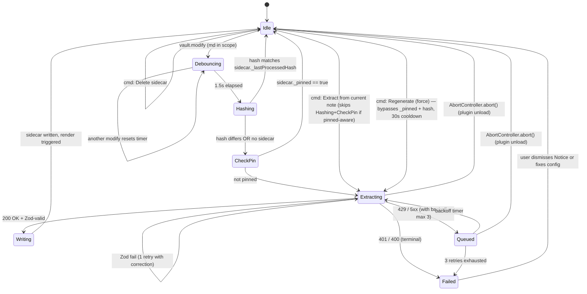

# Visual Notes — Design Document

**Version:** 0.1 (design phase)
**Date:** 2026-05-02
**Status:** Approved for implementation

> A system that watches daily-note markdown in Obsidian, extracts a concept-map
> graph via an LLM, and renders an interactive visual at the top of the note.
> Replaces an earlier Claude-Code-hook-driven approach that could only see
> content the agent passed through tool calls — leaving manual edits invisible
> to the visual.

---

## 1. Vision & Goals

### Why this exists

Today's daily-note workflow blends:

- AI-written session summaries appended via `obsidian append` (from Claude Code, OpenCode, and other AI clients)
- Manually-typed notes (meeting summaries, asides, status, ideas)
- Auto-generated content (Dataview queries, Templater output)

A previous iteration generated an iframe-embedded Cytoscape concept map by
having the AI agent write a JSON sidecar after each session. That worked but
**structurally cannot capture content the agent didn't write itself**. Manual
edits, content from other AI clients, and offline-typed mobile notes are all
invisible to the visual.

The plugin path makes the **markdown file the universal interface**: whoever
modifies it (Claude Code, claude.ai web/mobile, OpenCode, Cline, manual
typing on any device) → the plugin reacts and updates the visual.

### Goals

1. **Categorical completeness.** The visual reflects the entire day's content,
   not curated subsets.
2. **Cross-platform.** Runs wherever Obsidian runs (desktop + mobile).
3. **Cross-client decoupled.** Independent of which AI agent (if any) wrote
   the source content.
4. **Self-contained installable artifact.** A user with no Claude Code
   subscription can install just the Obsidian plugin and benefit.
5. **Deterministic rendering.** Same markdown → same visual structure (modulo
   layout). Visual quality is the LLM's responsibility but consistency comes
   from a fixed schema and prompt.

### Before / after comparison

For users currently on the Claude-Code-hook-driven workflow:

| Concern | Before (hook-driven) | After (plugin-driven) |
|---|---|---|
| Trigger | Agent runs `obsidian append` | Anything that writes to the .md file |
| Sidecar author | Agent designs graph + writes JSON | LLM extraction reads the .md, produces JSON |
| Manual edits | Invisible to the visual | Captured on next save |
| Mobile edits | Invisible | Captured after sync |
| Multi-client (Copilot, OpenCode, etc.) | Each needs its own integration | Each writes markdown; plugin handles the rest |
| Cost basis | Agent token spend on graph design | Anthropic API spend per save (~$0.006) |
| Dependency on Claude Code | Required | Optional (works with no AI client at all) |

### Non-goals

- A general-purpose graph editor.
- Cross-note relationship visualization (that's ExcaliBrain's territory; we're
  scoped to per-note concept extraction).
- Real-time collaborative editing.
- A fancy settings dashboard (cost UI, model picker, prompt-template editor).
  Minimum viable settings: API key, watched folders (list), debounce ms.

---

## 2. System Architecture

### Three-component system

```
┌─────────────────────────────────────────────────────────────────┐
│                  Daily note folder (in vault)                   │
│                                                                 │
│   ┌─────────────────────┐         ┌─────────────────────┐       │
│   │  20260501.md        │         │  20260501-          │       │
│   │  (markdown,         │         │  overview.json      │       │
│   │  the source of      │         │  (sidecar, written  │       │
│   │  truth for input)   │         │  by either plugin)  │       │
│   │                     │         └─────────────────────┘       │
│   │  Read by Obsidian   │                  ▲                    │
│   │  plugin's file      │                  │ read at render     │
│   │  watcher            │                  │ time + on change   │
│   └──────────┬──────────┘                  │                    │
│              │                             │                    │
│              │ vault.on('modify')          │                    │
│              ▼                             │                    │
│      ┌──────────────────────────────┐      │                    │
│      │  Obsidian plugin             │──────┘                    │
│      │  - reads markdown            │  writes sidecar           │
│      │  - calls Claude API          │                           │
│      │  - mounts Cytoscape inline   │                           │
│      │    via MarkdownPostProcessor │                           │
│      └──────────────────────────────┘                           │
│                                                                 │
│  Note: the plugin never modifies the daily note (.md) itself.   │
│  Reading-only on .md, read+write on the .json sidecar.          │
└─────────────────────────────────────────────────────────────────┘
                ▲                                ▲
                │                                │
   ┌────────────┴───────────┐    ┌───────────────┴──────────────┐
   │  Obsidian plugin       │    │  Claude Code plugin           │
   │  (primary)             │    │  (optional companion)         │
   │                        │    │                               │
   │  - Watches markdown    │    │  - Hook on `obsidian append`  │
   │  - Calls Anthropic API │    │  - May write sidecar with     │
   │  - Renders inline      │    │    `_pinned: true` to claim   │
   │    Cytoscape via       │    │    authoritative ownership    │
   │    MarkdownPostProc.   │    │  - Skill: design heuristics   │
   │  - Honors `_pinned`    │    │    for agent pre-population   │
   │    on the sidecar      │    │                               │
   └────────────────────────┘    └───────────────────────────────┘
```

The two plugins **share a JSON schema** (defined in `shared/schema.json`) for
the sidecar file. They do NOT need to be installed together — either alone
suffices for the user's workflow.

**Invariants** (any future contributor must preserve):

1. The Obsidian plugin **only reads** the `.md` file. It writes the `.json`
   sidecar. This avoids feedback loops with any future hook that watches
   `.md` files.
2. The sidecar is the **single source of truth** for visual content. Anyone
   wanting to influence the visual writes the sidecar.
3. `_pinned: true` on a sidecar **suppresses LLM extraction**. Treat as a
   contract, not a hint.

### Data flow: Obsidian plugin path (primary)

```
User saves daily note
      ↓
vault.on('modify') fires
      ↓
Debounce 1.5s (Obsidian's built-in debounce())
      ↓
Hash check: SHA-256 of markdown body vs. sidecar's _lastProcessedHash
      ↓
If unchanged → skip (handles Obsidian Sync's per-device modify storm)
If changed   ↓
      ↓
Anthropic Messages API call (Haiku 4.5 default)
  - System: extraction prompt + schema + few-shot examples
  - User: full markdown content
  - output_config: structured JSON via zodOutputFormat
      ↓
Parse response into typed object (zod-validated)
      ↓
Write {date}-overview.json sidecar (with new _lastProcessedHash)
      ↓
Trigger MarkdownPostProcessor refresh of the daily note's view
      ↓
Cytoscape mounts in MarkdownRenderChild container, reading the sidecar
```

### Data flow: Claude Code plugin path (legacy / complementary)

The existing Claude-Code-hook-driven system continues to work. When the agent
runs `obsidian append` to a Captain's Log file, a PostToolUse hook injects a
prompt asking the agent to update the visual. The agent reads the daily note
and writes the sidecar JSON directly. Last-writer-wins on the sidecar; either
system can populate it.

This is intentionally kept as a coexistence pattern, not a replacement: users
who don't have Claude Code installed still get full functionality from the
Obsidian plugin alone.

---

## 3. Shared Sidecar Schema

The contract between the two plugins. Lives at `shared/schema.json` as a
JSON Schema document; both plugins import it (the Obsidian plugin generates
TypeScript types via `json-schema-to-typescript`; the Claude Code plugin
references it in skill documentation).

### Format

```json
{
  "title":    "Daily Overview - 2026-05-01",
  "header":   "Daily Overview",
  "subtitle": "2026-05-01 — Hook fix · sidecar architecture · if-syntax decoded",
  "_lastProcessedHash": "sha256:abc123...",
  "_extractedBy": "obsidian-plugin@0.1.0",
  "nodes": [
    {
      "data": { "id": "kebab-id", "label": "Display\nLabel" },
      "classes": "system completed",
      "position": { "x": 250, "y": 200 }
    }
  ],
  "edges": [
    {
      "data": { "source": "id-a", "target": "id-b", "label": "verb phrase" },
      "classes": "strong-edge"
    }
  ]
}
```

### Field semantics

- `title` / `header` / `subtitle`: optional. Auto-derived from filename + date
  when omitted.
- `_lastProcessedHash`: SHA-256 of the markdown content the sidecar was
  generated from. Used to skip redundant API calls.
- `_extractedBy`: identifier for the producer (so debugging can attribute
  whether the Obsidian plugin or the Claude Code skill wrote a given sidecar).
- `nodes[].classes`: one type class + one status class.
  - **Type:** `system` (rectangle), `task` (ellipse), `decision` (diamond)
  - **Status:** `completed` (green), `active` (yellow), `context` (blue), `blocked` (red)
- `edges[].classes`: optional `strong-edge` (thick line) or `weak-edge`
  (dashed). Default is regular weight.
- `position`: pixel coordinates. **Currently provided by the LLM**; future
  versions may switch to Cytoscape's native layout (decision deferred — see
  §10 Open Questions).

### Versioning

Schema is at `v0.1.0` (matches initial repo version). Breaking changes bump
minor. Both plugins must agree on the schema version they support; the
sidecar gets an optional `_schemaVersion` field once we hit v1.0.

---

## 4. Obsidian Plugin Design

### 4.1 Components

```
plugins/obsidian-plugin/
├── manifest.json           # Plugin manifest (id, version, minAppVersion)
├── package.json            # npm dependencies
├── esbuild.config.mjs      # Build config (from obsidian-sample-plugin)
├── tsconfig.json
├── styles.css              # Plugin styles + Cytoscape container CSS
├── prompts/
│   └── extract-graph.md    # The structured-output prompt template
└── src/
    ├── main.ts             # Plugin entry, lifecycle, event registration
    ├── extractor.ts        # Anthropic API client, structured output
    ├── renderer.ts         # MarkdownPostProcessor, Cytoscape mount
    ├── settings.ts         # PluginSettingTab + persisted SettingsSchema
    ├── theme.ts            # Map Obsidian CSS vars → Cytoscape style
    ├── storage.ts          # API key storage (SecretStorage on desktop, data.json on mobile)
    ├── debounce.ts         # Wraps Obsidian's debounce() with content-hash dedup
    └── schema.ts           # Generated TypeScript types from shared/schema.json
```

### 4.2 Lifecycle

**Plugin load (`onload()`):**
1. Load settings from `data.json`
2. Initialize secure storage helper (probe `app.vault.getAdapter().getSecretStorage()`)
3. Register `PluginSettingTab`
4. Register `vault.on('modify')` event with debounced + hash-checked handler
5. Register `MarkdownPostProcessor` for files matching any watched-folder pattern
6. Register `app.workspace.on('css-change')` for theme refresh

**File save:**
1. `vault.on('modify')` fires
2. Path filter: only files inside any of the watched folders (recursive),
   only `.md` files (not the sidecar `.json` itself, which would create
   a feedback loop)
3. Pass to debounced handler (1.5s wait, configurable)
4. Hash check the markdown body; skip if unchanged from sidecar's
   `_lastProcessedHash`
5. Call `extractor.extract(markdownContent)`
6. Write sidecar JSON via `vault.modify()` (atomic write, triggers another
   modify event but the hash check prevents loop)
7. Notify any open MarkdownPostProcessor instances of the file to re-render

**Markdown view render (`MarkdownPostProcessor`):**
1. For each rendered daily note, check for sibling `{date}-overview.json`
2. If sibling exists, mount a `MarkdownRenderChild` at the top of the rendered
   markdown
3. The child loads the sidecar, applies theme variables, mounts Cytoscape
4. Cache the Cytoscape instance by file path (don't re-mount on every view)

### 4.3 LLM Integration

**Transport: hand-rolled `requestUrl` against the REST endpoint.** Do NOT
wrap the official `@anthropic-ai/sdk`. The SDK uses `fetch` internally; on
mobile (Capacitor WebView) `fetch` is restricted by CORS. `requestUrl`
from Obsidian is the only path that works cross-platform. Hand-rolling
~30 lines of REST + Zod validation is simpler than monkey-patching the
SDK's transport.

**Validation: `zod ^3.25.0`.** Define a `GraphSchema` (Zod) mirroring
`shared/schema.json`; parse the response body through it. If validation
fails, treat as a soft error (log + retry with a "your previous response
was malformed JSON, please retry following the schema" follow-up message).

**API request shape (concrete):**

```typescript
const body = {
  model: 'claude-haiku-4-5',          // user-configurable
  max_tokens: 2048,
  system: systemPrompt,                // bundled extraction prompt
  messages: [{ role: 'user', content: markdownContent }],
  output_config: { format: { type: 'json_schema', schema: graphJsonSchema } }
};

const response = await requestUrl({
  url: 'https://api.anthropic.com/v1/messages',
  method: 'POST',
  headers: {
    'x-api-key': apiKey,
    'anthropic-version': '2023-06-01',
    'content-type': 'application/json',
  },
  body: JSON.stringify(body),
  throw: false,    // we handle non-2xx ourselves
});
```

The response's `content[0].text` is the JSON string; parse + validate
against `GraphSchema`.

**Type-safety pipeline.** Without the SDK, type safety lands client-side:

```
requestUrl(...)            // returns RequestUrlResponse
  ↓ .text                  // string
  ↓ JSON.parse(...)        // any (UNSAFE)
  ↓ GraphSchema.parse(...) // typed Graph (Zod)  ← belt
  ↓ rendered               // Cytoscape consumes
```

The Anthropic API's `output_config.format.schema` is the server-side
schema enforcer (suspenders). The Zod parse is the client-side
enforcer (belt). Both layers are kept because:
- Server-side enforcement reduces malformed responses (cheaper retry)
- Client-side validation produces typed objects (no `any` leaks)
- If they ever disagree, our code crashes loudly rather than silently
  consuming bad data.

**Default model:** Claude Haiku 4.5. Concept extraction is a
pattern-matching task, not deep reasoning. ~$0.006/call, ~$2-5/month at
10 extractions/day. Sonnet 4.6 available as a settings opt-in (3× cost).
Opus is overkill — not exposed as a default option.

**Token budget pre-flight:**
- Estimate input tokens client-side (rough char/4 heuristic) before
  sending; reject notes over 100k tokens with a Notice.
- Typical daily note: 1,250–3,750 input tokens.
- System prompt: ~2,000 tokens.
- Output: 500–1,000 tokens.

**Error handling (bounded retry):**

| HTTP status | Action |
|---|---|
| 200 | Parse + validate against Zod schema. On Zod fail, retry once with schema-correction prompt. |
| 400 (bad request) | Log + Notice. Don't retry. |
| 401 (auth) | Notice with "open settings" affordance. Don't retry. |
| 429 (rate limit) | Honor `retry-after` header, exponential backoff, **max 3 retries**, then queue for next manual trigger (status-bar widget shows "queued"). |
| 5xx | Exponential backoff, **max 3 retries**, then queue. |
| Network failure | Treat as 5xx. |

All retries respect a **single `AbortController`** held on the Plugin
instance for the plugin's lifetime. Created in `onload()`; `abort()`
called in `onunload()`. Every `requestUrl` call passes the
controller's `.signal`, so plugin-disable cancels both in-flight
requests and any backoff-waiting queue entries. One controller, not
one-per-call — keeps lifecycle simple.

**Sidecar reload event-emitter** lives on the Plugin instance as
`this.sidecarEvents = new Events()` (Obsidian's built-in `Events`
class). Each `MarkdownRenderChild` constructor receives a reference to
the plugin and subscribes to `sidecarEvents.on('changed', filePath, …)`
in `onload()`, unsubscribes in `onunload()`. The extractor fires the
event after a successful write. No module-level singletons; teardown
is clean when the plugin is disabled.

**Logging strategy:** use `console.debug` for routine operations,
`console.warn` for recoverable problems (sidecar kind unknown,
malformed sidecar repaired), `console.error` for terminal errors that
also fire a Notice. No telemetry / analytics in v0.1. The Plugin class
exposes a `log(level, msg, data?)` helper that namespaces every
message with `[visual-notes]` so users filtering DevTools can find
plugin output quickly.

**No streaming.** Fire-and-forget extraction; the JSON response is small
enough (~750 output tokens) to render instantly when complete.

### 4.4 Rendering: Cytoscape inline

**Pattern:** `registerMarkdownPostProcessor()` → `MarkdownRenderChild` →
mount Cytoscape into a `<div>` injected at the top of the rendered note.

**Theme integration:** Read Obsidian CSS variables at mount time:
```typescript
const cs = getComputedStyle(document.documentElement);
const theme = {
  bg: cs.getPropertyValue('--background-primary').trim(),
  text: cs.getPropertyValue('--text-normal').trim(),
  accent: cs.getPropertyValue('--accent-color').trim(),
  // ... map to Cytoscape's style format
};
```

Subscribe to `app.workspace.on('css-change')` → rebuild Cytoscape style on
theme toggle (no re-mount needed, just `cy.style().fromJson(...).update()`).

**Caching strategy.** Don't use a static `Map<filePath, Cytoscape>` —
Obsidian creates multiple `MarkdownRenderChild` instances for the same
file across split panes, hover previews, embedded references, and tab
switches. A path-keyed singleton causes one view's `onunload()` to
dispose a Cytoscape instance another view is using.

Instead: **the Cytoscape instance lives on the `MarkdownRenderChild`**.
Each child gets its own instance, mounted on `onload()` and disposed in
`onunload()`. Multiple views of the same file = multiple Cytoscape
instances; this is fine because graph data is small and instance
construction is fast (~tens of ms).

If profiling later shows this is too expensive, fall back to a
`WeakMap` keyed by the container element — but only if measurement
demands it.

**Sidecar reload:** When the sidecar JSON is rewritten by extraction,
notify all live `MarkdownRenderChild` instances watching that file via
a shared event-emitter. Each instance loads the new graph data into its
own Cytoscape via `cy.json({ elements: { ... } })`. No remount, no
flicker — just a data update.

**Why not iframe?** The legacy approach used a `file://` iframe with a
self-contained HTML file. Inside a plugin, we own the renderer — direct
Cytoscape mount is simpler, faster, theme-integrated, no sandbox
concerns. The iframe path is dropped in v0.1.

### 4.5 Settings UI

Minimum viable. `PluginSettingTab` with these fields:

| Setting | Type | Default | Storage |
|---|---|---|---|
| Anthropic API key | text (password style) | empty | SecretStorage on desktop, data.json on mobile (with warning) |
| Watched folders | list of text inputs (add/remove buttons) | empty list (forces explicit config) | data.json |
| Debounce (ms) | number | 1500 | data.json |
| Model | dropdown (Haiku 4.5 / Sonnet 4.6) | Haiku 4.5 | data.json |

**Watched folders is a list, not a single value.** Many users have
multiple daily-note folders (work + personal, or per-project). The
plugin watches all of them; each folder produces its own per-day
sidecars in-place. There is no per-folder configuration — same prompt,
same model, same schema across folders. If a user needs different
behavior per folder (e.g., different model for personal vs work),
that's a future feature; v0.1 keeps the dial uniform.

The "Watched folders" default is **deliberately empty**. The plugin
stays inert until the user adds at least one folder. On plugin load, if
the list is empty AND the API key is set, surface a one-time Notice:
"Visual Notes: add a watched folder in Settings to enable extraction."

Watcher logic: `vault.on('modify')` fires for any file change. The
plugin checks whether the file's parent (or any ancestor) is in the
watched-folders list. If yes, queue for extraction. If no, ignore.
Subfolders inherit watch by default (e.g., adding `Captains Log`
also watches `Captains Log/2026/`).

**Command palette entries** (always available):

| Command | Behavior |
|---|---|
| `Visual Notes: Extract from current note` | Manual extraction. Bypasses debounce, runs immediately. Useful for "the visual is stale, force it." Honors `_pinned: true` and silently no-ops on pinned sidecars (with a Notice "sidecar is pinned — unpin first"). |
| `Visual Notes: Regenerate (force)` | Discards the cached `_lastProcessedHash` AND ignores `_pinned: true`. Useful when the LLM produced a bad graph and you want a fresh attempt regardless of pin state. **Rate-limit guard: 30-second cooldown per file.** Repeated invocations within the cooldown silent-no-op with a Notice "regenerate cooldown — wait Ns"; protects against rage-click rate-limit blowouts. |
| `Visual Notes: Pin this overview` | Sets `_pinned: true` on the current note's sidecar. Suppresses future LLM extractions until unpinned. Use this when the current visual is exactly what you want kept (e.g., agent-curated graph you don't want overwritten). |
| `Visual Notes: Unpin this overview` | Sets `_pinned: false`. Resumes auto-extraction on next save. |
| `Visual Notes: Delete sidecar` | Removes the sidecar JSON (and the rendered visual). Escape hatch. Fires Notice "sidecar deleted — next save will re-extract" so the user knows the recovery path. |

**Status bar:** A small indicator showing today's extraction count and a
spinner during in-flight calls ("Visual Notes: extracting…"). Replaces a
full cost-tracking dashboard for v0.1; gives users enough visibility to
catch runaway behavior without complexity.

- **"Today" boundary**: local midnight in the OS timezone (vault has no
  timezone concept; OS is the closest stable proxy). Persisted to
  `data.json` as `{date: "YYYY-MM-DD", count: N}`. Resets on first
  extraction after midnight.
- **Color/state**: gray when configured + idle; yellow with spinner
  during in-flight; red when configuration is incomplete (no API key
  OR empty watched-folders list). Red state is the "high-discoverability cue"
  for first-run users who haven't finished setup.
- **First-run Notice**: after the first successful extraction in a
  fresh install, fire a one-time Notice (gated by `firstRunComplete: false`
  in `data.json`): _"Visual Notes: first extraction succeeded. Cost ~$0.006
  per save at default model. See settings to change."_ Sets cost
  expectations at the moment they matter.
- **401 affordance**: on 401, fire a `Notice` with text _"Visual Notes:
  API key invalid. Open Settings → Visual Notes."_ at 8s duration on
  desktop, 15s on mobile. Obsidian Notices don't natively support
  clickable links; the text-instruction pattern is the standard
  Obsidian-plugin idiom.

**Cut from MVP:**
- Custom prompt override (textarea). Premature on day 1; users haven't
  yet hit cases where the bundled prompt fails them.
- Cost dashboard. Status-bar count is sufficient.
- Per-folder configs.

**Settings migration.** `data.json` carries an internal field
`_settingsVersion` (semver string, separate from the plugin's manifest
version). Plugin `onload()` reads `_settingsVersion`; if the value is
older than the current code expects, runs an idempotent migration
function before settings are bound to the UI. The migration list is a
chain of `(from → to)` transformations checked in declared order; each
should be safe to re-run. v0.1 ships with `_settingsVersion: "0.1.0"`
and an empty migration list — the convention is established before it
becomes painful to add.

### 4.6 Sync collision handling

Multi-device problem: every device running Obsidian Sync sees its own
`vault.on('modify')` for the same change. Without dedup, N devices each
hit the API for the same content.

Solution: **content-hash dedup**.

```typescript
// Schema requires the "sha256:" prefix; prepend it once at compute time.
const hash = 'sha256:' + sha256(markdownContent);   // hex-digest, 64 chars
const sidecar = await readSidecarIfExists(notePath);
if (sidecar?._lastProcessedHash === hash) {
  return; // Already extracted this exact content
}
const result = await extract(markdownContent);
result._lastProcessedHash = hash;
await writeSidecar(notePath, result);
```

This solves the most common sync race. Two narrower windows remain:

**Mid-flight race:** Device A starts extraction at T=0; device B
receives the same markdown via Sync at T=0.5; B's hash check sees no
sidecar yet (A hasn't written) → B starts a duplicate extraction. Both
write sidecars; last-writer-wins, but the user paid the API call twice.

Mitigation (deferred to Phase 6, documented as known limitation here):
write a `.lock` placeholder sidecar before the API call (atomic rename
on completion). Or use a content-addressed-temp-file + rename pattern.

**Concurrent edits across devices:** Device A and B both edit a daily
note simultaneously while offline; Obsidian Sync resolves the markdown
conflict; both devices then trigger extraction on the merged result. In
practice this manifests as one extra API call (the second device sees
its own merged hash mismatch the first device's sidecar). Acceptable
for v0.1.

**Document as known limitation in the README + plugin settings help
text.** No data corruption, just occasional duplicate API spend.

---

## 5. Claude Code Plugin Design

### 5.1 Components

```
plugins/claude-code-plugin/
├── .claude-plugin/
│   └── plugin.json         # Manifest (name, version, description)
├── hooks/
│   ├── hooks.json          # Wrapper format (PostToolUse → Bash matcher)
│   ├── post-obsidian-append.md  # Frontmatter + prompt body
│   └── run-hook.sh         # Generic hook runner; honors match_content frontmatter
└── skills/
    └── visual-notes/
        ├── SKILL.md        # Stripped-down: points users at the Obsidian plugin
        └── references/     # (optional, may stay empty post-migration)
```

### 5.2 Coexistence with Obsidian plugin

Both plugins write the same sidecar schema. The Claude Code path stays
useful for:

- Users who write detailed session summaries via AI clients and want the
  agent to control visualization narrative (e.g., highlight specific nodes)
- Workflows where the agent needs to inject curated graph state that the
  LLM extraction wouldn't produce automatically

The two systems compose:
1. Agent appends session summary to daily note
2. Obsidian plugin's file-watcher kicks in (debounced 1.5s)
3. Plugin extracts a fresh graph from the FULL note content
4. Sidecar gets overwritten with the LLM's view

OR (alternative ordering):
1. Agent appends session summary
2. Claude Code hook fires, agent writes sidecar with curated graph
3. Obsidian's debounced extraction triggers next, overwrites with LLM view

**Last writer wins WITH a `_pinned` escape hatch (v0.1, not deferred).**
Both producers target the same schema. The Obsidian plugin honors
`_pinned: true` on read: if the existing sidecar has `_pinned: true`,
the plugin skips its own extraction and respects the existing data.

This protects deliberate, curated agent-authored graphs from being
silently overwritten by probabilistic LLM extraction. Without `_pinned`,
the design ships data loss as a feature — unacceptable.

Implementation cost: ~5 lines in the Obsidian plugin's
`shouldSkipExtraction()` check. Deferring it to a "future feature" was
called out by the architecture review as ship-blocking; landing it on
day 1.

**Default behavior:** the Claude Code plugin's hook does NOT
automatically set `_pinned`. The agent has to choose to pin a sidecar
explicitly when it wants its content to be authoritative. This avoids
surprising the user when they install both plugins and lose the
LLM-extraction behavior they signed up for.

### 5.3 Migration path

- **Phase 0 (today):** Claude Code plugin handles everything. Obsidian
  plugin doesn't exist yet.
- **Phase 1:** Obsidian plugin shipped, sidecar schema unchanged. Both
  systems coexist; user installs both.
- **Phase 2 (optional):** Strip the visual-notes skill down to a stub
  pointing at the Obsidian plugin. Claude Code plugin keeps the
  obsidian-append hook for note-writing assistance only.

---

## 6. The Extraction Prompt

Lives at `plugins/obsidian-plugin/prompts/extract-graph.md`. Bundled with
the plugin; user can override via settings (advanced).

### Structure

```markdown
You are extracting a concept map from an Obsidian daily note. Read the
markdown below and return a JSON object describing the day's main concepts
and their relationships.

# Heuristics (apply all)

1. **Every edge has a label.** The label IS the insight ("caused by",
   "blocks", "is part of", "led to"). No bare connections.
2. **Hierarchy encodes importance.** Central concepts have multiple edges;
   peripheral ones have one or two.
3. **Max 30 nodes total.** If the note covers more, group related items
   into cluster nodes labeled with a short summary like "build issues (4)".
4. **Semantic status colors:**
   - `completed` (green) — finished outcomes, decisions made
   - `active` (yellow) — in-progress work, open questions
   - `context` (blue) — background facts, references, dependencies
   - `blocked` (red) — explicitly stuck items
5. **Shape encodes type:**
   - `system` (rectangle) — tools, services, codebases, files
   - `task` (ellipse) — actions, work items
   - `decision` (diamond) — choices made, discoveries, design points
6. **Cross-domain links are gold.** When the note connects unrelated areas,
   surface those as weak edges (dashed style) — they're often the most
   interesting findings.

# Schema

Return JSON only, matching this structure:

{
  "title": "Daily Overview - YYYY-MM-DD",
  "subtitle": "<one-line summary of the day's themes>",
  "nodes": [
    {
      "data": { "id": "kebab-id", "label": "Display\nLabel" },
      "classes": "<type> <status>",
      "position": { "x": <int>, "y": <int> }
    }
  ],
  "edges": [
    {
      "data": { "source": "id1", "target": "id2", "label": "verb phrase" },
      "classes": "<strong-edge|weak-edge|>"
    }
  ]
}

# Layout

Place clusters in a horizontal sweep across the canvas. Each major theme
gets its own cluster (~250px apart vertically, 250px between nodes within
a cluster). Major clusters are separated by ~450px horizontally.

# Examples

[Two or three short markdown→JSON examples, ~100 words of markdown each]

# Markdown

{full_markdown_content}
```

### Few-shot examples

Two examples bundled:
1. A short engineering session (3-5 nodes, demonstrates type/status mapping)
2. A multi-cluster day (15+ nodes, demonstrates clustering + cross-domain
   weak edges)

These are the highest-leverage prompt-engineering investment. Iterate on
the examples first when extraction quality is off.

### Prompt-engineering anti-patterns to avoid

- ❌ "Best represent this as a concept map" → vague
- ❌ Generic node names like "Concept", "Idea", "Thing"
- ❌ Asking the LLM to determine "max nodes" itself
- ✅ Concrete constraints, schema with example values, explicit do/don't lists

---

## 7. Look & Feel

### Visual style

Cytoscape rendered with **Catppuccin** color palette (Latte for light,
Mocha for dark). Theme variables read from Obsidian's CSS at mount time.

| Status | Latte (light) bg | Latte border | Mocha (dark) bg | Mocha border |
|---|---|---|---|---|
| `completed` | `#a6e3a1` | `#40a02b` | `#a6e3a1` | `#94e2d5` |
| `active` | `#f9e2af` | `#df8e1d` | `#f9e2af` | `#fab387` |
| `context` | `#89b4fa` | `#1e66f5` | `#89b4fa` | `#74c7ec` |
| `blocked` | `#f38ba8` | `#d20f39` | `#f38ba8` | `#eba0ac` |

Status fill colors stay the same across themes (Catppuccin's accent
palette is consistent); the page background, text, and borders shift
between Latte and Mocha. Read all values from Obsidian's CSS variables
at mount time — don't hardcode in the plugin.

### Shapes

- `system` — `round-rectangle`, padding 12px, label inside
- `task` — `ellipse`, padding 12px
- `decision` — `diamond`, padding 16px (more padding because diamonds visually
  shrink vs. rectangles at the same node-size setting)

### Edges

- Default — 2px solid, bezier curve, small triangle arrowhead
- `.strong-edge` — 3px, darker color, same shape
- `.weak-edge` — 1px dashed, lighter color, indicates cross-domain links

### Layout (current)

LLM produces explicit `{x, y}` positions following the prompt's layout
guidance. Cytoscape uses `layout: { name: 'preset' }` to honor them.

**Future:** A/B against `cose-bilkent` force-directed layout (let Cytoscape
position nodes; LLM only produces structure). Decision deferred — see §10.

### Interactivity

- **Click a node → scroll the markdown to the related section.** This is
  the killer interaction for journal use — turns the visual into a
  navigation aid, not just decoration. **Match precedence:**
  1. **Heading-slug match.** Compare the node's `data.id` (already
     kebab-case) to each markdown heading slugified the same way. First
     match wins. Most reliable signal because the LLM derives ids from
     headings.
  2. **Label substring match (case-insensitive).** Search the markdown
     body for the first occurrence of the node's `data.label` (with `\n`
     replaced by space).
  3. **No match.** Brief Notice "no match in markdown for '$label'"; no
     scroll. Indicates LLM hallucinated a node not grounded in text;
     useful debug signal.
  Document this precedence in the implementation notes for renderer.ts
  so behavior stays consistent across versions.
- **Hover** on a node → bold border, highlight all connected edges
- **Mouse out** → restore default
- **Pan** with click-drag, **zoom** with wheel/pinch (touch on mobile)
- **No node-drag.** Preset layout is authoritative; users who don't like
  positioning fix the markdown, not the visual.
- Min zoom 0.3, max zoom 3.0
- Keyboard: `f` fits viewport to graph, `r` resets zoom

### Mobile-specific

- Cytoscape canvas height: 350px on phones (vs. 450px on desktop) to
  preserve note-text real estate on narrow viewports.
- Touch gestures: pinch-zoom + drag-pan. No hover; tap a node for the
  jump-to-section behavior.
- Settings page: avoid horizontal layouts; vertical stack of text inputs.
  The "Advanced" disclosure stays collapsed by default on mobile.

### Header

Top-left corner of the canvas:
- `<h1>` with the `header` field (e.g., "Daily Overview")
- Subtitle below in muted text (e.g., "2026-05-01 — Hook fix · sidecar
  architecture")

### Legend

Top-right corner: small floating box with status dots (completed/active/
context/blocked) and shape labels (system/task/decision). Helps the user
parse the visual the first time they see it.

---

## 8. Repo Structure

```
visual-notes/
├── README.md                       # Top-level: project overview, install paths
├── LICENSE                         # MIT
├── .gitignore
├── pnpm-workspace.yaml             # Declares plugins/* and shared/ as workspaces
├── package.json                    # Root: dev tooling (typescript, eslint, prettier)
│
├── docs/
│   ├── design.md                   # THIS document
│   ├── architecture.md             # (Optional) deeper technical spec when impl starts
│   └── decisions/                  # ADR-style records as decisions accumulate
│       └── 0001-shared-schema.md
│
├── shared/
│   ├── schema.json                 # JSON Schema for sidecar
│   └── package.json                # Workspace package; generates TS types
│
└── plugins/
    ├── claude-code-plugin/
    │   ├── README.md               # Install: /plugin install ...
    │   ├── .claude-plugin/
    │   │   └── plugin.json
    │   ├── hooks/
    │   │   ├── hooks.json
    │   │   ├── post-obsidian-append.md
    │   │   └── run-hook.sh
    │   └── skills/
    │       └── visual-notes/
    │           └── SKILL.md
    │
    └── obsidian-plugin/
        ├── README.md               # Install: BRAT or community store
        ├── package.json
        ├── manifest.json
        ├── tsconfig.json
        ├── esbuild.config.mjs
        ├── styles.css
        ├── prompts/
        │   └── extract-graph.md    # System prompt + few-shot examples
        └── src/
            ├── main.ts
            ├── extractor.ts
            ├── renderer.ts
            ├── settings.ts
            ├── theme.ts
            ├── storage.ts
            ├── debounce.ts
            └── schema.ts
```

### Why pnpm workspaces

- Shared schema package is consumed by both plugins; workspace symlinks
  avoid copying.
- Single root `node_modules` keeps disk usage and install time manageable.
- Per-plugin `package.json` keeps dependencies scoped (Obsidian plugin
  has Anthropic SDK + cytoscape; Claude Code plugin has nothing).

### CI/CD

`.github/workflows/`:
- `obsidian-release.yml` — on tag `obsidian-v*`: build, package, create
  GitHub release with `manifest.json` + `main.js` + `styles.css` as
  assets (BRAT/community-store consumable)
- `claude-code-release.yml` — on tag `claude-v*`: validate plugin.json
  schema, no build artifacts (Claude Code plugins distribute as git refs)
- `ci.yml` — on PR: typecheck, lint, validate JSON schemas

Path filters limit each workflow to its component's files.

### Versioning

**Independent.** Plugins evolve at different cadences. Tag prefix
distinguishes:
- `obsidian-v0.1.0` — Obsidian plugin release
- `claude-v0.1.0` — Claude Code plugin release
- `schema-v0.1.0` — Sidecar schema bump (forces both plugins to declare
  compatibility)

---

## 9. Implementation Phases

### Phase 1 — Scaffold + Obsidian plugin MVP (1.5–2 weeks)

Budget honestly: this is a fresh TypeScript Obsidian plugin with esbuild,
zod, an external API integration, and inline-rendered Cytoscape. A week
is doable for someone who's shipped Obsidian plugins before; budget 1.5–2
weeks otherwise.

- Repo scaffolded ✅ (initial commit landed)
- Extraction prompt authored ✅ (`prompts/extract-graph.md`, with two
  few-shot examples). The plugin has nothing to send without this.
- Copy `esbuild.config.mjs`, `tsconfig.json`, `version-bump.mjs`,
  `versions.json`, `styles.css` from
  [obsidian-sample-plugin](https://github.com/obsidianmd/obsidian-sample-plugin).
  Don't reinvent.
- Obsidian plugin skeleton: manifest, plugin entry that registers a
  no-op `MarkdownPostProcessor` and `PluginSettingTab`
- Settings tab with API key field (plaintext, no SecretStorage yet)
- Generate `src/schema.ts` from `shared/schema.json` via
  `json-schema-to-typescript`
- Manual command: `Visual Notes: Extract from current note`. No
  file-watching, no debouncing yet.
- `extractor.ts`: hand-rolled `requestUrl` to Anthropic Messages API,
  Zod-validate response
- Write sidecar JSON next to the note
- Verify happy path on one daily note end-to-end

### Phase 2 — Auto-extraction + rendering (week 2)

- File-watcher with debounce + content-hash dedup
- MarkdownPostProcessor mounts Cytoscape from sidecar JSON
- Theme integration (CSS vars → Cytoscape style)
- Caching: Map<filePath, cytoscapeInstance> with onload/onunload lifecycle

### Phase 3 — Settings polish + storage (week 3)

- SecretStorage on desktop, plaintext warning on mobile
- Per-folder configurability (different model/prompt per watched folder — v0.1 keeps the dial uniform)
- Model dropdown (Haiku / Sonnet)
- Custom prompt override (textarea)

### Phase 4 — Distribution (week 4)

- BRAT release (tag `obsidian-v0.1.0-beta.0`)
- Submit to Obsidian community plugin store
- Document install paths in README

### Phase 5 — Claude Code plugin migration (week 5)

- Pull existing `~/ai/skills/visual-notes/` and `~/ai/hooks/` content
  into `plugins/claude-code-plugin/`
- Strip skill down to "the Obsidian plugin handles this; write good notes"
- Create `.claude-plugin/marketplace.json` for distribution
- Both plugins coexist; users can install either or both

### Phase 6 — Polish (ongoing)

- A/B test LLM-positioned vs `cose-bilkent` layout
- Cost-tracking widget (optional, originally cut from MVP)
- Multi-vault config
- More few-shot prompt examples

---

## 9b. Failure modes & lifecycle states

Every external dependency can fail; designing for it up front is cheaper
than debugging in the wild.

### Lifecycle state machine



The `Idle → Extracting (cmd: Regenerate force)` transition is the
unpin-and-extract escape hatch. The user is never stuck with a pinned
sidecar; force-regen overrides.

### Failure scenarios + handling

| Scenario | Handling |
|---|---|
| **API key missing** on plugin load | Status-bar shows "Visual Notes: configure API key". File watcher stays inert. |
| **Watched folders list empty** on plugin load | Status-bar shows "Visual Notes: add a watched folder". One-time Notice on first load. |
| **A configured folder doesn't exist in the vault** | Notice on plugin load naming the missing folder. Other configured folders continue to be watched normally; the missing one is rechecked next load. |
| **Anthropic API down** (5xx) | Bounded retry (3×, exponential backoff). On exhaustion, queue for next manual trigger; status-bar shows "queued". |
| **Network failure** (no internet) | Treated as 5xx. Same retry/queue behavior. |
| **Rate limit** (429) | Honor `retry-after`, exponential backoff, max 3 retries. |
| **Auth failure** (401) | Notice with "open settings" affordance. Don't retry. |
| **Bad request** (400) | Log to console, Notice. Suggests model/prompt issue; don't retry. |
| **Malformed response from API** (Zod-invalid JSON) | One retry with schema-correction prompt. Then fail. |
| **Sidecar JSON malformed** (someone wrote bad JSON) | Renderer logs the error, displays a "⚠ malformed sidecar" placeholder in the note. Does NOT crash the post-processor. |
| **Daily note deleted mid-flight** | Catch the `vault.modify()` error on sidecar write; discard result silently. |
| **Sidecar exists but markdown doesn't** (orphaned) | Renderer shows the visual as-is (data is still valid). User can manually delete via the "Delete sidecar" command. |
| **Plugin disabled mid-flight** | `AbortController.abort()` in `onunload()` cancels the in-flight `requestUrl`. No write happens. |
| **Two views of same file open** | Each `MarkdownRenderChild` owns its own Cytoscape instance. No cache collision. |
| **Obsidian Sync delivers sidecar mid-extraction** | Hash check at extraction completion; if the just-arrived sidecar's hash matches what we just extracted, no-op. |
| **Sidecar `kind` is non-default** (`session-whiteboard`, `rollup`) | v0.1 renders only `kind: "daily-overview"` (or sidecars with `kind` omitted, which default to that). For unsupported kinds, the renderer logs `console.warn("Visual Notes: unsupported sidecar kind '${k}', skipping render")` and skips mounting. The sidecar is preserved unchanged. |
| **Sidecar `kind` field schema-valid but unknown to plugin** (future kind we don't yet support) | Same as above — log + skip, don't crash. |
| **API key valid but user hits org quota** (529 overloaded) | Treat as 5xx: bounded retry with backoff, then queue. |
| **User pastes API key with leading/trailing whitespace** | Trim on save in settings handler. |

### What we explicitly DON'T handle in v0.1

- Multi-vault settings divergence (Obsidian vault model is per-vault by default)
- Recovery from a corrupted plugin `data.json` (Obsidian re-creates from defaults)
- API key rotation mid-session (user restarts plugin or Obsidian)
- LLM hallucination of nonsense graphs (manual `Regenerate (force)` is the escape hatch)

---

## 10. Open Questions / Decisions for the Implementation Team

### Layout algorithm

**Question:** Stick with LLM-produced positions (current schema), or strip
positions from the schema and use Cytoscape's `cose-bilkent` force-directed
layout?

**Decision:** **Stick with LLM positions for v0.1.** A/B against `cose-bilkent`
as a Phase 6 polish item. The LLM-positions approach preserves the
hand-crafted clustered layout the user has been using; switching costs
prompt re-engineering and a visual style change.

### Mobile API key UX

**Question:** Mobile can't use SecretStorage. Three options:
- (a) Plaintext in `data.json` with a stark warning
- (b) Disable extraction on mobile entirely
- (c) Require user to set up a separate mobile-scoped API key with
      reduced permissions

**Decision:** **(a)** for v0.1. Mobile users opt-in by entering the key,
warned in the settings description. Future: explore (c) when Anthropic
ships fine-grained API key scoping.

### Multi-vault config

**Question:** What if a user has multiple Obsidian vaults and wants
different settings per vault?

**Decision:** Out of scope for v0.1. Settings are per-vault by Obsidian
default (each vault has its own `.obsidian/plugins/<id>/data.json`).
That's good enough.

### Obsidian Sync race conditions

**Question:** Two devices simultaneously extract the same note. Each
writes a sidecar. Which wins?

**Decision:** Last-writer-wins via Obsidian Sync's natural file-merge
semantics. Content-hash dedup prevents the extraction from happening on
both devices in the common case (one device extracts first, sidecar syncs,
second device sees matching hash and skips).

### Custom prompts

**Question:** Should we support per-folder or per-tag prompt customization?

**Decision:** Out of scope. v0.1 is one global prompt. Power users can
override the whole prompt via settings.

---

## 11. References

### Obsidian Plugin Development

- [Obsidian Plugin Docs](https://docs.obsidian.md/Home)
- [Sample Plugin Repository](https://github.com/obsidianmd/obsidian-sample-plugin)
- [MarkdownPostProcessor reference](https://docs.obsidian.md/Reference/TypeScript+API/MarkdownPostProcessor)
- [PluginSettingTab reference](https://docs.obsidian.md/Reference/TypeScript+API/PluginSettingTab)
- [Vault API docs](https://docs.obsidian.md/Plugins/Vault)
- [Obsidian community plugin store submission](https://github.com/obsidianmd/obsidian-releases)
- [BRAT (Beta Reviewers Auto-update Tool)](https://github.com/TfTHacker/obsidian42-brat)
- [Juggl plugin (Cytoscape reference impl)](https://github.com/HEmile/juggl)

### Anthropic API

- [Claude API quickstart](https://platform.claude.com/docs/en/docs/quickstart)
- [Structured outputs guide](https://platform.claude.com/docs/en/build-with-claude/structured-outputs)
- [Token counting API](https://platform.claude.com/docs/en/build-with-claude/token-counting)
- [Error handling reference](https://platform.claude.com/docs/en/api/errors)
- [Prompt engineering best practices](https://platform.claude.com/docs/en/build-with-claude/prompt-engineering/claude-prompting-best-practices)
- [Pricing](https://platform.claude.com/pricing)
- [`@anthropic-ai/sdk` npm](https://www.npmjs.com/package/@anthropic-ai/sdk)

### Claude Code Plugins

- [Claude Code plugin docs](https://code.claude.com/docs/en/plugins)
- [Plugin reference](https://code.claude.com/docs/en/plugins-reference)
- [Plugin marketplaces](https://code.claude.com/docs/en/plugin-marketplaces)
- [Hooks docs](https://code.claude.com/docs/en/hooks)
- [Anthropic's official marketplace](https://github.com/anthropics/claude-plugins-official)

### Cytoscape.js

- [Cytoscape.js docs](https://js.cytoscape.org/)
- [cose-bilkent layout](https://github.com/cytoscape/cytoscape.js-cose-bilkent)
- [cytoscape-css-variables extension](https://github.com/lukethacoder/cytoscape-css-variables)

### Tooling

- [pnpm workspaces](https://pnpm.io/workspaces)
- [json-schema-to-typescript](https://github.com/bcherny/json-schema-to-typescript)
- [Catppuccin palette](https://github.com/catppuccin/catppuccin)

---

## Appendix A — Glossary

| Term | Meaning |
|---|---|
| **Sidecar** | The `{date}-overview.json` file that lives next to the daily note, holding the extracted graph data. |
| **Watched folders** | The list of Obsidian folders the plugin monitors for daily-note changes. Empty by default; user must add at least one. Subfolders are watched recursively. |
| **Daily note** | A markdown file named `YYYYMMDD.md` in any of the watched folders. |
| **Overview** | The visual concept map rendered for a daily note. |
| **Session-whiteboard** (legacy) | Per-conversation `{date}-session-{n}.json` sidecars from the original visual-notes skill. **Note:** "session" elsewhere in this doc refers to a conversational unit (an "AI session summary" in a daily note). When ambiguous, use "session-whiteboard" for the file format and "session summary" or "conversation" for the content unit. |
| **Producer** | Any code that writes a sidecar. The Obsidian plugin and the Claude Code plugin are the two producers. |
| **`_pinned`** | A boolean field in the sidecar that, when `true`, suppresses LLM extraction by the Obsidian plugin. Used by the Claude Code plugin to claim authoritative ownership of a sidecar. User toggles via the Pin/Unpin commands; force-regenerate command bypasses. |
| **MarkdownPostProcessor** | Obsidian API hook for post-render content injection. The plugin uses it to inject the Cytoscape canvas into the rendered markdown view of any daily note that has a sidecar. |
| **MarkdownRenderChild** | Obsidian lifecycle wrapper for rendered content. Each instance owns one Cytoscape canvas and is torn down when the view closes. |
| **BRAT** | Beta Reviewers Auto-update Tool. The standard Obsidian-plugin distributor for pre-release builds. Users add a repo URL and BRAT pulls the latest tagged release. |

## Appendix B — Debugging Visual Notes

For maintainers and the user when something doesn't work as expected.

| Symptom | Where to look |
|---|---|
| Visual doesn't appear | Open DevTools (Ctrl+Shift+I in Obsidian). Filter console for `[visual-notes]`. Check for "no watched folders configured", "API key invalid", or extraction errors. Also: confirm the note's folder is in the watched-folders list. |
| Visual is stale | Run `Visual Notes: Regenerate (force)` from command palette. Bypasses pin and cached hash. |
| Visual shows wrong content | Check the sidecar: open `{date}-overview.json` next to the daily note. Is `_pinned: true`? An agent may have locked it; run `Visual Notes: Unpin this overview` then regenerate. |
| Repeated API calls visible in status-bar count | Check that the `_lastProcessedHash` field is being written to the sidecar (look for `sha256:` prefix). If absent, the dedup is broken. |
| Plugin loads then errors immediately | Verify `manifest.json` `minAppVersion ≤` your Obsidian version. Otherwise `getSecretStorage` may be unavailable. |
| Extraction succeeds but render is blank | Validate the sidecar against `shared/schema.json` — possibly an unknown `kind`, malformed JSON, or out-of-bounds positions. |
| Settings UI fields are gone after upgrade | Check `data.json` `_settingsVersion`. The migration step may have failed; restore from a backup of `data.json` (Obsidian writes `data.json.bak` on save). |

The Plugin instance exposes `(window as any).__visualNotes` in dev
builds — gives DevTools console access to the extractor, sidecar
events, and current settings. Useful for live debugging without
reaching for the source.

---

## Appendix C — Things explicitly cut from MVP

These are intentional non-goals for the first release. Documenting them so
future contributors don't relitigate.

- Cost transparency UI (running token spend display in settings)
- Streaming API responses
- Per-folder configs
- Per-tag configs
- Custom theme palettes
- Layout algorithm picker (deferred to Phase 6)
- Obsidian Canvas (.canvas) output format
- Native Obsidian Graph View integration
- Mind-map export
- PNG/SVG export of the rendered graph
- Bidirectional sync (visual edits writing back to markdown)
