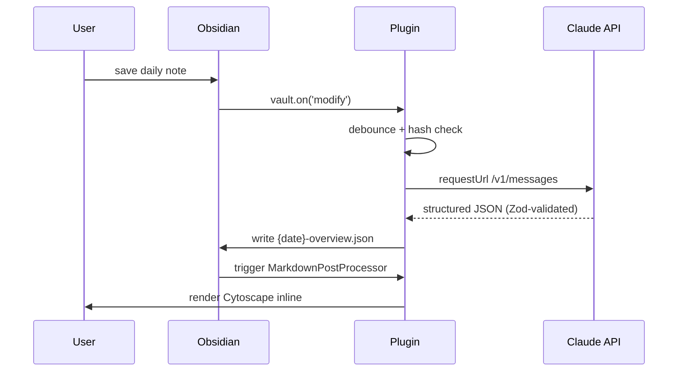

# Visual Notes — Obsidian plugin

The primary artifact of the [Visual Notes](../..) project. Watches daily
notes in a configured folder, calls the Claude API to extract a concept-map
graph from the markdown, applies a deterministic layout pass, and renders an
interactive Cytoscape visual at the top of the rendered note view.

## Status

🚧 **MVP implementation in progress.** The plugin includes the Obsidian build
scaffold, settings tab, manual and watched-folder extraction, sidecar writing,
section-aware sidecar metadata, deterministic layout, pin/unpin/delete commands,
status-bar extraction count, token-usage metadata, and inline Cytoscape
rendering from the sidecar.

The top-level [`../../README.md`](../../README.md) has the product and
architecture overview. The living [`../../docs/design.md`](../../docs/design.md)
tracks remaining design work and open decisions.

## Install (after first release)

### Beta channel via BRAT (recommended during development)

1. Install [BRAT](https://github.com/TfTHacker/obsidian42-brat) in Obsidian.
2. In BRAT settings, add this repository's path:
   `bobthearsonist/visual-notes`.
3. BRAT installs the plugin from the latest GitHub release whose tag exactly
   matches `manifest.json`'s version.

### Community plugin store (after first stable release)

Search "Visual Notes" in Obsidian → Settings → Community plugins.

## Release packaging

From the repository root, run:

```bash
pnpm package:obsidian
```

This builds the plugin and writes the Obsidian release assets to
`dist/obsidian-plugin`:

- `manifest.json`
- `main.js`
- `styles.css`

See [`../../docs/marketplace-readiness.md`](../../docs/marketplace-readiness.md)
for the release, tag, and marketplace submission checklist.

### Manual sideload (development)

```bash
cd ~/.obsidian/plugins/  # path to your vault's .obsidian/plugins dir
git clone https://github.com/bobthearsonist/visual-notes.git
cd visual-notes/plugins/obsidian-plugin
pnpm install
pnpm build
# Restart Obsidian, enable "Visual Notes" in Community plugins
```

## Configure

After install, open Settings → Visual Notes:

| Setting | What it does |
|---|---|
| **Anthropic API key** | Required. Get one at [console.anthropic.com](https://console.anthropic.com). Stored in plaintext `data.json` for this first pass. |
| **Watched folders** | A list of folders containing daily notes. **Empty by default** — add at least one for the plugin to do anything. Subfolders are searched recursively. Add multiple folders if you keep separate work/personal/project journals (e.g., `Captains Log`, `0 Daily ADHD Brain Logs`, `Projects/visual-notes/Journal`). Each folder produces its own sidecars in-place; same model, same prompt, same schema across all watched folders. |
| **Debounce (ms)** | How long to wait after the last save before extracting. Default: 1500ms. |
| **Model** | `claude-haiku-4-5` (default, ~$0.006/extraction) or `claude-sonnet-4-6` (~$0.02). |
| **Use Daily Context** | When the `daily-context` plugin is available, extract from structured daily sources instead of raw note markdown. |

Custom prompt override is **not exposed in v0.1** — the bundled extraction
prompt at `prompts/extract-graph.md` is the canonical heuristic source.
Advanced users wanting different extraction behavior can fork the plugin or
wait for the prompt-override field in a later release.

## How it works



See the architecture overview in [`../../README.md`](../../README.md) and the
future-facing notes in [`../../docs/design.md`](../../docs/design.md).

## Cost

At the default Haiku model: **~$0.006 per extraction**. With debouncing and
content-hash dedup, expect **5-15 extractions per day** for an active note
schedule. Total: **~$2-5/month**.

Bring your own API key. The plugin does not proxy or aggregate usage.

### Local-only integration profile

Default tests use public fixtures and do not call Anthropic. To verify a private
Daily Context output locally, copy `test/local/local-profile.example.json` to a
gitignored `test/local/<name>.local.json` and run:

```bash
VISUAL_NOTES_LOCAL_PROFILE=test/local/<name>.local.json npm run test:local
```

To run the optional Anthropic smoke test, first generate the local extraction
output, then copy `test/local/local-anthropic.example.json` to a gitignored
profile with `"allowAnthropic": true` and run with all gates enabled:

```bash
VISUAL_NOTES_RUN_LOCAL_ANTHROPIC=1 \
ANTHROPIC_API_KEY=... \
VISUAL_NOTES_LOCAL_ANTHROPIC_PROFILE=test/local/<name>.local.json \
npm run test:local:anthropic
```

The Anthropic smoke test is never part of default validation. It prints only
redacted metadata and never commits prompts, source text, or generated graphs.

## Sources of content

By default, the plugin extracts from the active note. When Daily Context is
enabled and available, it extracts from that provider's structured source list
instead. The explicit **Extract from current note using Daily Context** command
requires the provider and does not fall back to raw markdown.

Raw-note mode sees **everything** in the daily note:
- AI session summaries written by Claude Code, OpenCode, Copilot, etc.
- Manually typed notes
- Mobile edits synced via Obsidian Sync
- Templater-generated content
- Dataview query output (rendered text only)

If it's in the file, the LLM extraction sees it.

## Privacy / data handling

The plugin sends either Daily Context source content or raw note markdown to
Anthropic's API for extraction. By default, your notes do not stay on Anthropic's
servers beyond what's required for the API call (see [Anthropic's privacy policy](https://www.anthropic.com/legal/privacy)).
Sensitive notes you don't want sent to a third-party API should not live in any
watched folder or Daily Context source.

### Why my old `*-overview.html` files aren't being updated

The plugin reads `*-overview.json` sidecars and renders them inline
in Obsidian. The static HTML files some older vaults contain were
produced by a legacy agent-curated workflow that is no longer the
target architecture. The HTMLs remain on disk as reference but the
plugin doesn't regenerate or read them. See
[the design notes](../../docs/design.md#legacy-hook-artifacts-vs-plugin-renderer)
for context.

## License

MIT — see [`../../LICENSE`](../../LICENSE).
