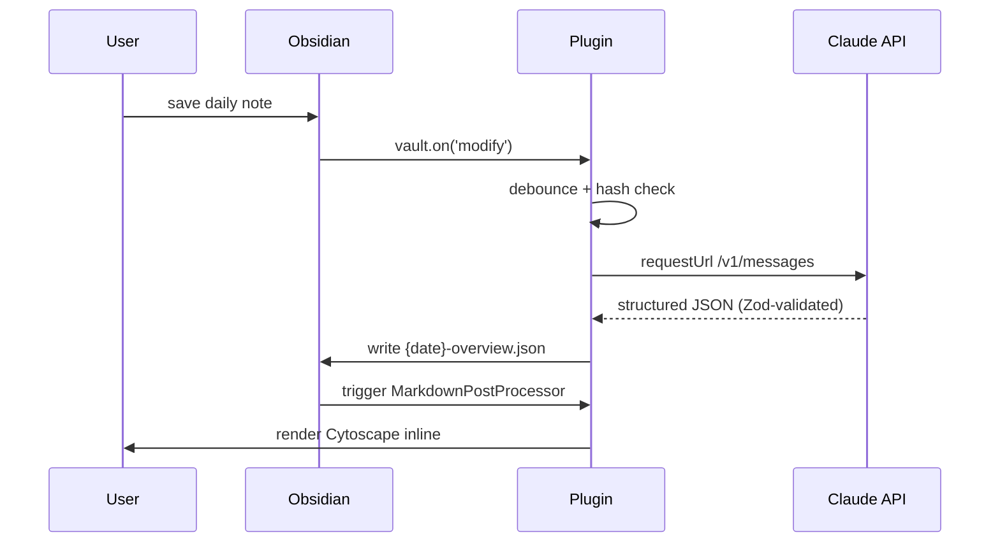

# Visual Notes — Obsidian plugin

The primary artifact of the [Visual Notes](../..) project. Watches daily
notes in a configured folder, calls the Claude API to extract a concept-map
graph from the markdown, and renders an interactive Cytoscape visual at
the top of the rendered note view.

## Status

🚧 **Phase 1 — scaffold only.** Manifest and directory structure are in
place; implementation pending. See [`../../docs/design.md`](../../docs/design.md)
§4 for the full design and §9 for implementation phases.

## Install (after first release)

### Beta channel via BRAT (recommended during development)

1. Install [BRAT](https://github.com/TfTHacker/obsidian42-brat) in Obsidian.
2. In BRAT settings, add this repository's path:
   `bobthearsonist/visual-notes` (BRAT supports monorepos via path config —
   see release notes for the specific tag pattern).
3. BRAT installs the plugin from the latest `obsidian-v*` release.

### Community plugin store (after first stable release)

Search "Visual Notes" in Obsidian → Settings → Community plugins.

### Manual sideload (development)

```bash
cd ~/.obsidian/plugins/  # path to your vault's .obsidian/plugins dir
git clone https://github.com/bobthearsonist/visual-notes.git
cd visual-notes/plugins/obsidian-plugin
pnpm install
pnpm build
# Restart Obsidian, enable "Visual Notes" in Community plugins
```

## Configure

After install, open Settings → Visual Notes:

| Setting | What it does |
|---|---|
| **Anthropic API key** | Required. Get one at [console.anthropic.com](https://console.anthropic.com). Stored in OS keychain on desktop, plaintext `data.json` on mobile (with warning). |
| **Watched folder** | The folder containing your daily notes. **Empty by default** — you must set this for the plugin to do anything. Subfolders are searched. Examples: `Daily Notes`, `Journal`, `Captains Log`. |
| **Debounce (ms)** | How long to wait after the last save before extracting. Default: 1500ms. |
| **Model** | `claude-haiku-4-5` (default, ~$0.006/extraction), `claude-sonnet-4-6` (~$0.02), or `claude-opus-4-7` (~$0.03). |
| **Custom prompt** | Optional. Overrides the bundled extraction prompt. Advanced users only. |

## How it works



See [`../../docs/design.md`](../../docs/design.md) §4.2 for the full lifecycle.

## Cost

At the default Haiku model: **~$0.006 per extraction**. With debouncing and
content-hash dedup, expect **5-15 extractions per day** for an active note
schedule. Total: **~$2-5/month**.

Bring your own API key. The plugin does not proxy or aggregate usage.

## Sources of content

The plugin sees **everything** in the daily note:
- AI session summaries written by Claude Code, OpenCode, Copilot, etc.
- Manually typed notes
- Mobile edits synced via Obsidian Sync
- Templater-generated content
- Dataview query output (rendered text only)

If it's in the file, the LLM extraction sees it.

## Privacy / data handling

The plugin sends the **full markdown content** of the daily note to Anthropic's
API for extraction. By default, your notes do not stay on Anthropic's servers
beyond what's required for the API call (see [Anthropic's privacy policy](https://www.anthropic.com/legal/privacy)).
Sensitive notes you don't want sent to a third-party API should not live
in the watched folder.

## License

MIT — see [`../../LICENSE`](../../LICENSE).
